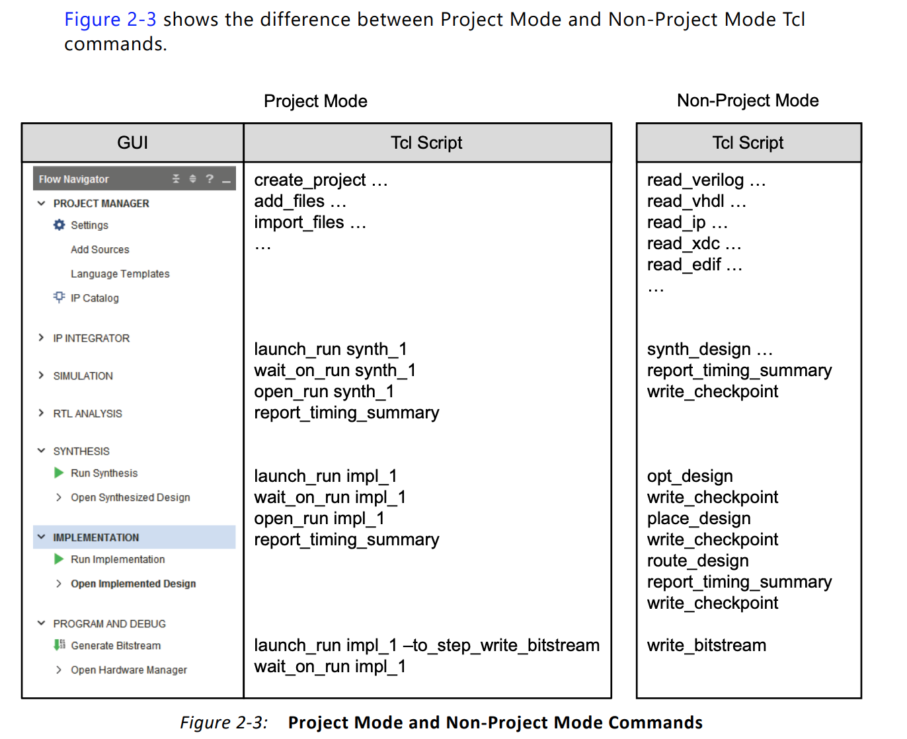

# Vivado Partial Reconfiguration Script Template

Jan 17, 2020  Yizhou Shan <syzwhat@gmail.com>

The scripts are adopted from Xilinx open-source scripts.
I made few changes for my own research needs.
The scripts will make the PR flow super easy.

Everything is script-based here, i.e., Vivado non-Project mode, which is useful if you are using remote servers.
You can always open GUI within vivado shell, but it is different from Vivado Project mode.
If you want to use Project mode, you can checkout the `write_project_tcl` command.

A nice thing is that all vivado commands will be saved to log files,
thus you can learn and mimic the general build flow.

The whole thing is like vivado-build framework,
where you express your needs in the top `run_vivado.sh` file.
The majority of the magic happens within `scripts/*` files.
Happy hacking!

## Run

You can do `make`, `make clean`.

The original code is targeting VCU118 and Vivado 2019.1.
You can change board information within `run_vivado.tcl`.
Vivado versions do not matter too much.

## Tips

Generated files:

1. All Synthesize results and checkpoint are in `generated_synth`.
2. All Implementation results go into `generated_implement`.
3. Some routed checkpoint files go into `generated_checkpoint`.

Commands:

- `open_checkpoint ./generated_synth/static/top_synth.dcp`
- `open_checkpoint ./generated_checkpoint/*.dcp`
- `read_checkpoint ./generated_checkpoint/*.dcp`
- Check `command.log` files

Infrastructure:

- We define all the modules including the static module and PR modules in `run_vivado.tcl`.
  Each module can have multiple sources such as Verilog, BD scripts and so on.
- This building infrastructure defines the `module` concept, and associate a lot properties with it.

## Misc

