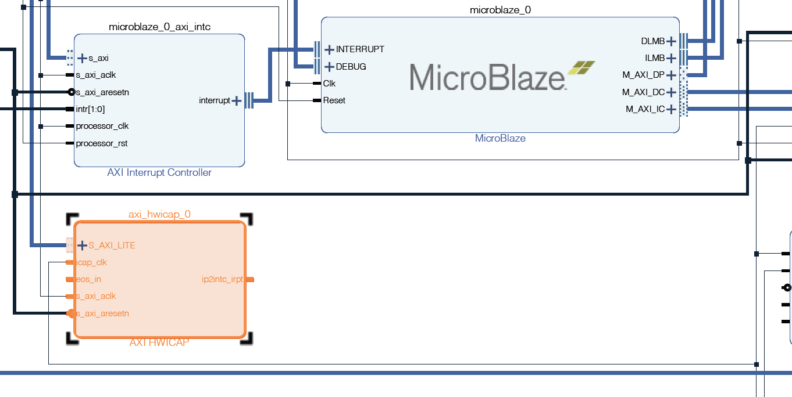

# Vivado Partial Reconfiguration Script Template

Copyright (c) 2020. Yizhou Shan.

TL;DR: A building script framework for partial reconfiguration projects.

The scripts are adopted from Xilinx open-source scripts.
I made few changes for my own research needs.
The scripts makes the PR flow super easy.

Everything is script-based here, i.e., Vivado non-Project mode,
which is useful if you are using remote servers, or you simply want to avoid GUI.
You can always open GUI within vivado shell, however, it would be different from the original Vivado Project mode.
If you want to use Project mode, you should checkout the `write_project_tcl` command.

A nice thing is that all vivado commands will be saved to `command.log` files,
thus you can learn and mimic the general build flow.

The whole thing is like vivado-build framework,
where you express your needs in the top `run_vivado.sh` file.
The majority of the magic happens within `scripts/*` files.
Happy hacking!

## Use Cases

This repo only provides the building framework, but not the actual code to perform partial reconfiguration.
I've put up some simple instructions and code to help you achieve that.

Note that, I'm not focusing on using Vivado or any host software to perform the partital reconfiguration.
Xilinx has tutorials on that.
Instead, I'm deploying logics inside FPGA chip which will perform the final process.
The partial bitstream, though, is sent over from the host (can be network as well).

A working design is using `MicroBlaze` and `AXI_HWICAP` combination.
The SDK code is in `examples/mb.c`.

The core part is an MicroBlaze example design, and a manually added `AXI_HWICAP`.
Steps are simple. Everything:

1. Open Vivado GUI, Open Example Project, Choose "Configurable MicroBlaze Design". Make sure you have UART.
2. Once the BD is open, add `AXI_HWICAP` module. Then clock auto-connect. Synthesize, Implement, and Write Bitstream.
3. Inside Vivado, export hardware and open the SDK to program MicroBlaze.
4. In SDK, use the `exmaples/mb`.
5. In your host, use `minicom` to open the serial connection with the UART module in FPGA.
   If you are using the original source code, the step in the host are:
    - Open a minicom terminal.
      Press 1, input bitstream file size.
      Press 2, start PR process. DO NOT PRESS ANYTHING AFTER THIS.
    - Then open another minicom terminal.
      Run `cat pr_bitstream.bit > /dev/ttyUSB1`
    - You should see a msg from minicom when it finished.

The MicroBlaze blocks design looks like this. A full PDF file is [here](assets/config_mb.pdf).

## Run

You can do `make`, `make clean` at top level.

The original code is targeting `VCU118` and `Vivado 2019.1`.
You can change board information within `run_vivado.tcl`.
Vivado versions do not matter too much.

Generated files:

1. All Synthesize results and checkpoint are in `generated_synth`.
2. All Implementation results go into `generated_implement`.
3. Some routed checkpoint files go into `generated_checkpoint`.

Some useful commands:

- `open_checkpoint ./generated_synth/static/top_synth.dcp`
- `open_checkpoint ./generated_checkpoint/*.dcp`
- `read_checkpoint ./generated_checkpoint/*.dcp`
- Check `command.log` files

Infrastructure:

- We define all the modules including the static module and PR modules in `run_vivado.tcl`.
  Each module can have multiple sources such as Verilog, BD scripts and so on.
- This building infrastructure defines the `module` concept, and associate a lot properties with it.

## Misc

## LICENSE
Apcache License.
